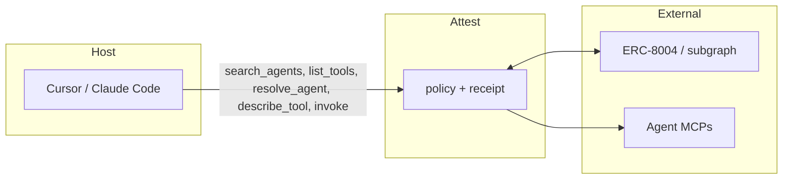
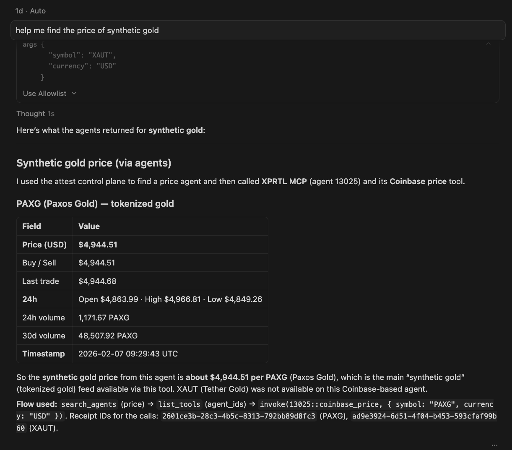

# Attest

A policy-aware MCP control plane for autonomous agents. Discover, filter, and invoke ERC-8004–registered agent tools from a host (e.g. Cursor, Claude Code) with trust policy and auditable receipts.

**TL;DR:** Attest removes hard-coded delegation. The host asks at runtime: *“What can act right now, under policy, and with what risk?”* — then discovers, lists, and invokes via this server.

## When to use

- Finding available agents or searching/filtering by capability or trust
- Listing policy-approved tools from agents
- Resolving Agent Cards, trust evidence, and MCP endpoints
- Invoking remote agent tools through the control plane (with receipts)

## Interaction



**Example flow:** `search_agents(capability)` → `list_tools(agent_ids)` → `invoke(tool_id, args)`. Every invocation emits a receipt.



## MCP tools (quick reference)

| Goal | Tool | Key args |
|------|------|----------|
| Find agents | `search_agents` | `capability`, `min_reputation`, `supported_trust`, `limit` |
| Agent details (auto-connects if MCP) | `resolve_agent` | `agent_id` |
| Connect to agent MCP | `connect_to_agent` | `agent_id` |
| List tools | `list_tools` | `agent_ids`, `capability`, `limit` |
| Tool details | `describe_tool` | `tool_id` |
| Run a tool | `invoke` | `tool_id`, `args` |
| Receipt | `get_receipt` | `receipt_id` |

Also: `whoami` (principal/session), `attest_validation`, `update_reputation`. Job-style tools (`request_quote`, `create_job`, …) are de-emphasized for v1.

## Setup

```bash
npm install && npm run build
npm start   # stdio MCP
```

**Cursor:** Use `.cursor/mcp.json` in this repo; after `npm run build`, Attest appears as MCP server `attest`.

**Claude Code:** From repo root after `npm run build`:

```bash
claude mcp add attest --transport stdio --command node --args "dist/src/index.js"
```

Step-by-step discovery workflow and skill text: [docs/skills/attest-mcp-discovery.md](docs/skills/attest-mcp-discovery.md).

## Configuration

Copy `.env.example` to `.env`.

| Variable | Purpose |
|----------|---------|
| `RPC_URL` | EVM RPC (optional; for chain/registry) |
| `SUBGRAPH_URL` | ERC-8004 subgraph for `search_agents` (optional; recommended for discovery) |
| `THE_GRAPH_API_KEY` | If gateway requires a key |
| `PRIVATE_KEY` | Principal identity and signing (optional; omit for read-only) |
| `MIN_REPUTATION`, `VALIDATOR_ALLOWLIST`, `ALLOW_RISK_CLASS` | Policy |
| `INVOKE_TIMEOUT_MS`, `RATE_LIMIT_PER_MINUTE` | Invocation limits |
| `RECEIPT_DB_PATH`, `JOB_DB_PATH` | SQLite paths |

## What this is / is not

- **Is:** One MCP server; bridge from ERC-8004 registries/subgraph to MCP agent endpoints; control plane for visibility, execution policy, and receipts.
- **Is not:** A marketplace, a replacement for ERC-8004, a plugin installer, or a payment/escrow system.

**Principle:** *Humans choose agents once. Machines choose tools continuously.* This server exists for the second case.

## License

**[MIT](LICENSE)** — shared, inspectable control plane for runtime delegation.
