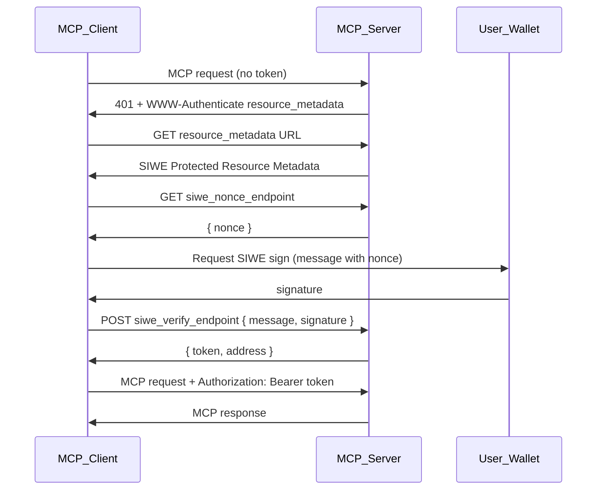

# RFC: Sign-In with Ethereum (SIWE) for Model Context Protocol

**Title:** SIWE Protected Resource Metadata for MCP  
**Status:** Informational  
**Created:** 2025-02  
**Author** Nikko Ambroselli <video.wooded.6d@icloud.com>
**References:** EIP-4361 (SIWE), RFC 9728 (OAuth Protected Resource Metadata), RFC 6750 (Bearer Token), RFC 8615 (Well-Known URIs), MCP Specification (Authorization)

---

## Abstract

This document defines a standard for Sign-In with Ethereum (SIWE) authentication for the Model Context Protocol (MCP). It specifies a discovery format and authorization flow that parallel RFC 9728 (OAuth 2.0 Protected Resource Metadata), enabling MCP servers to advertise SIWE support and MCP clients to obtain Bearer tokens via wallet signing. The goal is interoperability for Web3-native MCP deployments without requiring OAuth authorization servers.

---

## 1. Introduction

### 1.1 Purpose and Scope

The Model Context Protocol provides authorization capabilities at the transport level for HTTP-based MCP servers. The existing MCP authorization specification is OAuth-centric: clients discover authorization servers via Protected Resource Metadata (RFC 9728) and obtain access tokens through OAuth 2.1 flows.

Many MCP use cases involve Web3 users who authenticate via wallet signatures (Sign-In with Ethereum, EIP-4361) rather than OAuth. There is currently no standard way for:

- MCP servers to advertise SIWE support, or
- MCP clients to discover SIWE endpoints and complete a wallet-based sign-in.

This RFC defines **SIWE Protected Resource Metadata**: a metadata format and discovery mechanism that mirror RFC 9728, so that MCP servers can indicate SIWE authentication and clients can obtain Bearer tokens by following the SIWE flow (nonce, sign, verify, token).

**Scope:** HTTP-based MCP transports (e.g. Streamable HTTP). STDIO and other transports are out of scope; credential handling for those is environment- or deployment-specific.

### 1.2 Requirements Notation

The key words "MUST", "MUST NOT", "REQUIRED", "SHALL", "SHALL NOT", "SHOULD", "SHOULD NOT", "RECOMMENDED", "NOT RECOMMENDED", "MAY", and "OPTIONAL" in this document are to be interpreted as described in BCP 14 (RFC 2119, RFC 8174) when they appear in all capitals.

---

## 2. Standards Compliance and References

This specification aligns with:

- **EIP-4361:** Sign-In with Ethereum (message format, verification).
- **RFC 9728:** OAuth 2.0 Protected Resource Metadata (discovery pattern, well-known URI, WWW-Authenticate).
- **RFC 6750:** The OAuth 2.0 Authorization Framework: Bearer Token Usage.
- **RFC 8615:** Well-Known URIs.
- **MCP Specification:** Authorization section (transport-level auth, Bearer token usage).

---

## 3. Roles

| Role | Description |
|------|-------------|
| **MCP Server** | The protected resource requiring authentication. It acts as the SIWE verifier and session token issuer. |
| **MCP Client** | Obtains a SIWE session token on behalf of the resource owner and sends it with MCP requests. |
| **Resource Owner** | The user who signs the SIWE message with their Ethereum wallet. |

---

## 4. SIWE Protected Resource Metadata

SIWE Protected Resource Metadata is a JSON document that describes how to authenticate to an MCP server using Sign-In with Ethereum. Its structure is parallel to RFC 9728 Section 2 (Protected Resource Metadata).

### 4.1 Metadata Parameters

| Parameter | Requirement | Description |
|-----------|-------------|-------------|
| `resource` | REQUIRED | The resource identifier: canonical URI of the MCP server (e.g. `https://mcp.example.com/mcp`). As in RFC 9728, this SHOULD use the `https` scheme and have no fragment. |
| `siwe_nonce_endpoint` | REQUIRED | URL for the nonce endpoint. Client sends GET; server returns `{ "nonce": "<string>" }`. |
| `siwe_verify_endpoint` | REQUIRED | URL for the verify endpoint. Client sends POST with `{ "message", "signature" }`; server returns `{ "token", "address" }`. |
| `siwe_domain` | REQUIRED | Domain value for the SIWE message (EIP-4361). Must match the server's authoritative domain (e.g. `mcp.example.com` or `localhost:4000`). |
| `siwe_statement` | OPTIONAL | Human-readable statement included in the SIWE message (e.g. "Sign in to MCP Server"). |
| `siwe_chain_id` | OPTIONAL | Chain ID for the SIWE message. Default is 1 (Ethereum mainnet) if omitted. |
| `resource_name` | RECOMMENDED | Human-readable name of the MCP server for display to the user. |
| `scopes_supported` | OPTIONAL | List of scope values (e.g. `["mcp:tools", "mcp:resources"]`) for future scope binding. |

Additional parameters MAY be defined by extensions; unknown parameters MUST be ignored by clients.

### 4.2 Well-Known URI

A distinct well-known path is used so as not to overload the OAuth Protected Resource Metadata and to allow servers to support both OAuth and SIWE:

- **Suffix:** `siwe-protected-resource`
- **Full path:** `/.well-known/siwe-protected-resource` (or path-scoped as in Section 5.2).

---

## 5. Discovery Mechanisms

### 5.1 WWW-Authenticate Header

When an MCP server requires SIWE and receives a request without a valid Bearer token, it MUST respond with HTTP 401 Unauthorized and include the `WWW-Authenticate` header with the `resource_metadata` parameter pointing to the SIWE Protected Resource Metadata document.

Example:

```http
HTTP/1.1 401 Unauthorized
Content-Type: application/json
WWW-Authenticate: Bearer resource_metadata="https://mcp.example.com/.well-known/siwe-protected-resource"
```

The client uses the `resource_metadata` URL to fetch the metadata.

### 5.2 Well-Known URI

The metadata document MUST be available at a well-known location derived from the MCP server's resource identifier, following the same construction rules as RFC 9728 Section 3:

- **Resource with no path component** (e.g. `https://mcp.example.com`):  
  `https://mcp.example.com/.well-known/siwe-protected-resource`

- **Resource with path component** (e.g. `https://mcp.example.com/mcp`):  
  Insert `/.well-known/siwe-protected-resource` between the host and the path.  
  Example: `https://mcp.example.com/.well-known/siwe-protected-resource/mcp`

### 5.3 Client Discovery Requirements

- MCP clients that support SIWE MUST support both discovery mechanisms.
- When the server returns a 401 with `WWW-Authenticate` and a `resource_metadata` parameter, the client MUST use that URL to fetch the metadata.
- When the client has the MCP server URI but no 401 response (e.g. proactive discovery), the client MUST construct the well-known URI as in Section 5.2 and request the metadata.

---

## 6. SIWE Authorization Flow

### 6.1 Sequence Diagram



### 6.2 Step-by-Step Flow

1. **Initial request:** The client makes an MCP request without an `Authorization` header (or with an invalid or expired token).
2. **401 response:** The server responds with 401 and `WWW-Authenticate: Bearer resource_metadata="<url>"`.
3. **Fetch metadata:** The client fetches the SIWE Protected Resource Metadata from the `resource_metadata` URL using GET.
4. **Validate metadata:** The client validates that the `resource` value in the metadata matches the MCP server URI it is connecting to. If it does not match, the client MUST NOT use the metadata.
5. **Get nonce:** The client sends GET to `siwe_nonce_endpoint`. The server returns a JSON object `{ "nonce": "<string>" }`.
6. **Build SIWE message:** The client constructs an EIP-4361 message using the nonce, `siwe_domain`, `siwe_statement` (if present), `siwe_chain_id` (or default 1), and other required/optional fields per EIP-4361.
7. **User signs:** The client prompts the resource owner to sign the message via their Ethereum wallet (e.g. `personal_sign`).
8. **Verify:** The client sends POST to `siwe_verify_endpoint` with body `{ "message": "<EIP-4361 message>", "signature": "<hex signature>" }` and `Content-Type: application/json`.
9. **Token:** The server verifies the message and signature per EIP-4361, validates the domain matches `siwe_domain`, and issues a session token. It responds with 200 and `{ "token": "<session token>", "address": "<EIP-55 address>" }`.
10. **Authenticated requests:** The client sends `Authorization: Bearer <token>` on all subsequent MCP requests to the server.

---

## 7. Endpoint Specifications

### 7.1 Nonce Endpoint

- **Method:** GET
- **Response (200):** JSON object with a single member `nonce` (string).
- **Requirements:**
  - The nonce MUST be unique per request.
  - The nonce SHOULD be short-lived (e.g. 5 minutes) and invalidated after use or expiry.
  - The nonce MAY be generated using a cryptographically secure random source.

Example response:

```json
{ "nonce": "1739123456-a1b2c3d4e5" }
```

### 7.2 Verify Endpoint

- **Method:** POST
- **Content-Type:** application/json
- **Request body:** `{ "message": "<EIP-4361 message string>", "signature": "<hex-encoded signature>" }`
- **Success (200):** `{ "token": "<session token>", "address": "<EIP-55 checksummed address>" }`
- **Error (401):** `{ "error": "<human-readable description>" }` (or similar)

**Requirements:**

- The server MUST verify the SIWE message and signature in accordance with EIP-4361.
- The server MUST validate that the domain in the message matches the server's `siwe_domain` from the metadata.
- The server MUST issue a session token bound to the verified Ethereum address.
- Invalid or expired messages, or signature verification failure, MUST result in a 401 response.

---

## 8. Token Usage

- Session tokens obtained via the SIWE flow MUST be sent as specified in RFC 6750: `Authorization: Bearer <token>`.
- The token format is implementation-defined. JWT is RECOMMENDED; when JWT is used, the payload SHOULD include an `address` (or equivalent) claim for the principal.
- MCP servers MUST validate the token on each request and MUST extract the principal (Ethereum address) for request scoping (e.g. whoami, receipts, rate limits).
- Invalid or expired tokens MUST result in a 401 response with an appropriate `WWW-Authenticate` challenge.

---

## 9. Coexistence with OAuth

MCP servers MAY support both OAuth (per MCP Authorization specification) and SIWE:

- **OAuth:** Publish metadata at `/.well-known/oauth-protected-resource` with `authorization_servers` and follow RFC 9728 / OAuth 2.1.
- **SIWE:** Publish metadata at `/.well-known/siwe-protected-resource` with `siwe_nonce_endpoint`, `siwe_verify_endpoint`, and related parameters.

Clients MAY choose the authentication method based on user context (e.g. "Sign in with wallet" vs "Sign in with OAuth/Google"). The 401 `WWW-Authenticate` MAY include multiple challenges or a single `resource_metadata` that references a document listing both options; such extensions are outside the scope of this document.

---

## 10. Security Considerations

- **Replay:** The nonce prevents replay of the same SIWE message. Servers MUST reject reused nonces and SHOULD expire nonces after a short time.
- **Domain binding:** The SIWE message domain MUST match the server's `siwe_domain` to prevent phishing and confused deputy attacks. Servers MUST enforce this.
- **Token storage:** Clients SHOULD store session tokens securely. Use of `localStorage` for tokens in browser contexts is NOT RECOMMENDED for high-sensitivity deployments.
- **HTTPS:** All endpoints (metadata, nonce, verify, MCP) MUST use HTTPS in production.
- **CORS:** Servers that serve browser-based wallet flows SHOULD set appropriate CORS headers for the nonce and verify endpoints.

---

## 11. Example Metadata Document

For an MCP server at `https://mcp.example.com/mcp`:

```json
{
  "resource": "https://mcp.example.com/mcp",
  "siwe_nonce_endpoint": "https://mcp.example.com/auth/nonce",
  "siwe_verify_endpoint": "https://mcp.example.com/auth/verify",
  "siwe_domain": "mcp.example.com",
  "siwe_statement": "Sign in to MCP Server",
  "siwe_chain_id": 1,
  "resource_name": "Example MCP Server",
  "scopes_supported": ["mcp:tools", "mcp:resources"]
}
```

---

## 12. IANA Considerations (Optional)

If this specification is submitted for standardization:

- Register the well-known URI suffix: `siwe-protected-resource`.
- Create a registry for SIWE Protected Resource Metadata parameters to allow extensions.

---

## 13. References

- **EIP-4361:** Sign-In with Ethereum. https://eips.ethereum.org/EIPS/eip-4361
- **RFC 2119:** Key words for use in RFCs to Indicate Requirement Levels.
- **RFC 6750:** The OAuth 2.0 Authorization Framework: Bearer Token Usage.
- **RFC 8174:** Ambiguity of Uppercase vs Lowercase in RFC 2119 Key Words.
- **RFC 8615:** Well-Known URIs.
- **RFC 9728:** OAuth 2.0 Protected Resource Metadata.
- **MCP Specification:** Model Context Protocol, Authorization section. https://modelcontextprotocol.io/specification/latest/basic/authorization
